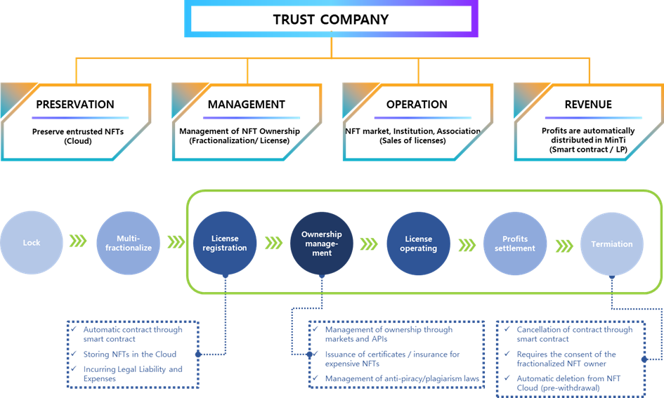

# 3. Trust company

Until now, in the NFT market, it has been a form of direct trading, but the reality is that the ownership and right to use the NFT cannot be effectively managed.

Most of the creations shown in the NFT market can be copied and used by anyone, and illegal copying and plagiarism cannot be managed, and if the data source uploaded to the cloud or server disappears, the problem of not receiving compensation for the asset value will be occurred.

Even now, most NFT markets do not show any tangible efforts to solve these problems, and responsibility is unclear. If this was an asset like real gold, there would be no NFT market that would operate like this.

Since we operate a market that trades assets and sells licenses for the ownership and use rights of NFTs, we must manage these issues thoroughly, and legally manage the possibility of piracy and plagiarism, which are characteristics of digital assets.

Therefore, in the MINTWAY market, in order to fractionalize an NFT or sell a license, the license must be registered with the NFT locked. At the same time as registration, the contract is automatically signed by the smart contract, and the locked NFT must be uploaded to the trust company's cloud storage to determine the contract completion. From this point on, the actual legal effect with the trust company takes effect, and from then on, the trust company manages the ownership.

The registered NFT generates a certificate in the name of the trust company that includes the creator, creations, and contents, and this is made public for anyone to see. In addition, through a separate contract, a person who uses the certificate without permission or illegal reproduction based on the certificate may be prosecuted by the trust company's legal team, and in the case of expensive NFTs, insurance may be purchased.

In addition, for data source security, data will be safely stored through a contract with a cloud company that has obtained the NST SP 800-53 certification standard designated by FedRAMP PMO, a cloud security certification organization in the United States.

Through this management, the trust company sells usage rights to global users through contracts with the MINTWAY market and associations and related organizations in each country, and the service fee for this profit is paid to the NFT owner by a smart contract.

At this time, each country and related institution receives the profits from its use in cash, so it is paid in cryptocurrency that can be used in the MINTWAY market through an LP outside the trust company.

The contract can be canceled through the NFT integrated wallet serviced by the MINTWAY market or MINTWAY portal. At this time, the file is automatically deleted from the cloud, so the original data must be withdrawn in advance. In addition, in the case of a divided NFT, the consent of the entire owner must be obtained.

In this way, the MINTWAY market preserves, manages, and operates NFTs in the same way as real assets to ensure the value and profit of the owner's assets.

