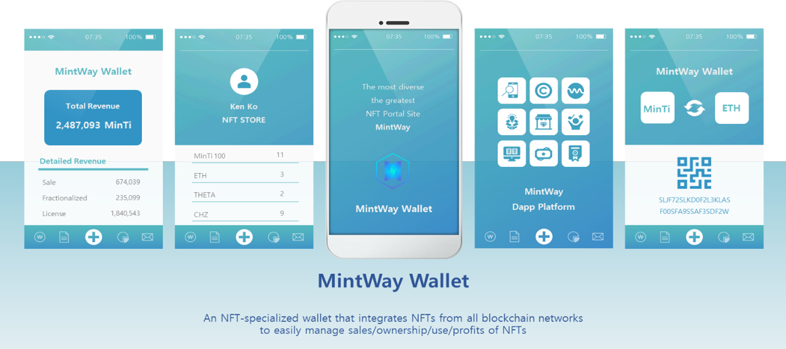

# 4. MINTWAY Wallet & MinTi

The MINTWAY Foundation, which will be in charge of the cryptocurrency ecosystem to be used in the MINTWAY portal, will create a new business structure in the global NFT market through developing a wallet that integrates and manages NFTs produced in numerous blockchain networks for various NFT businesses as well as NFT multi-fractionalizing solutions and cryptocurrencies that can trade usage rights.

\
Our token is denoted as “MinTi” in the sense that it is a currency used in NFT minting and NFT transactions, and  The type of cryptocurrency that can prove multiple division of ownership is **MinTi100**, and the type of cryptocurrency that is purchased, sold, and used in portals, licenses, Dapps, etc. is denoted as **MinTi**.

MINTWAY wallet is an integrated wallet that links all of three as follow; cryptocurrencies used in each block chain network for NFT production, MinTi100 prove multi-fractionalized ownership, and MinTi traded in portal and license, and Dapp,

First, the NFT Blockchain Network presents options so that users can mint NFTs with various tokens on the MINTWAY portal through a blockchain network that can produce NFTs, and allows users to choose gwei, etc. NFTs produced in this way can be traded with cryptocurrency in the same blockchain network as in the general market.

Second, NFT-MinTi100 is a cryptocurrency with an NFT format that will be used for proof of ownership when multiple ownership is fractionalized. It is made with a token on the blockchain mainnet selected by the original NFT owner. MinTi100 uses the MINTWAY market system to divide ownership of up to 100 pieces, and the user can directly determine the name of the MinTi100 at the time of division. Information on locked NFTs and prices are organically linked, and distribution information on license revenue is also stored at the same time.

\
Third, MinTi (Smart Contract) is a smart contract type cryptocurrency that will be used in multi-fractionalized NFT transactions and license purchases, Dapp Business, MINTWAY portal internal community, advertisements, etc.

MINTWAY wallet does not simply store cryptocurrency, it can directly manage NFT, MinTi100, MinTi, manage multi-fractionalization of ownership and license NFT linked to each blockchain network cryptocurrency, and know the price and information status of NFT linked with MINTWAY market.

As such, through the MINTWAY wallet, even in different blockchain networks, you can manage your NFT in an integrated way, you can check the license revenue at any time, and you can connect and use various Dapps linked with the MINTWAY portal.
