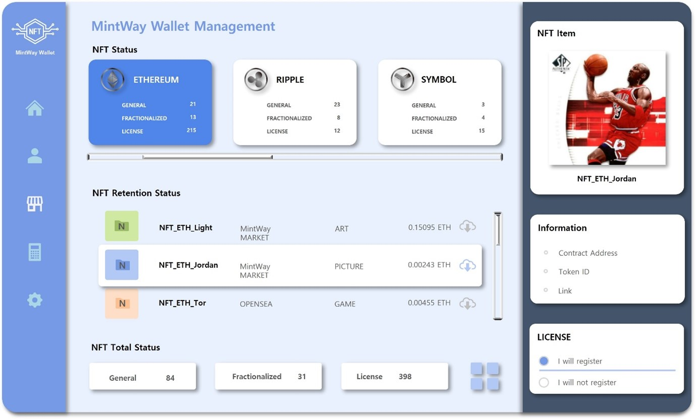

# 4. MINTWAY Wallet & MinTi

<figure><figcaption>
Figure 16. MINTWAY Wallet
</figcaption></figure>

MINTWAY포탈에서 사용할 암호화폐 생태계를 담당할 MINTWAY재단은 다양한 NFT비즈니스를 위해 수많은 블록체인 네트워크에서 제작된 NFT를 통합하여 관리할 수 있는 지갑개발과 NFT 다중분할 솔루션 및 사용권을 거래할 수 있는 암호화폐의 개발을 통해 글로벌 NFT시장의 새로운 비즈니스 구조를 만들어갈 것이다.

\
NFT민팅과 NFT 거래에서 사용되는 화폐라는 의미에서 “MinTi”라 표기하며, 소유권 다중분할을 증명할 수 있는 형식의 암호화폐는 MinTi100으로, 포탈, 라이선스, Dapp 등에서 구매, 판매, 사용하는 형식의 암호화폐는 MinTi라 표기한다.

MINTWAY지갑은 NFT제작을 위해 각 블록체인 네트워크에서 사용하는 암호화폐, 소유권 다중분할 증명 MinTi100, 포탈과 라이선스, Dapp에서 거래하는 MinTi 3가지를 모두 연동하는 통합지갑으로,

첫째, NFT Blockchain Network는 NFT를 제작할 수 있는 블록체인 네트워크를 통해 MINTWAY포탈에서 유저가 다양한 토큰으로 NFT를 민팅할 수 있도록 선택권을 제시하고, 가스비 등을 유저가 선택할 수 있게 하기 위함이다. 이렇게 제작된 NFT는 일반 마켓과 동일하게 동일한 블록체인 네트워크의 암호화폐로 거래할 수 있다.

둘째, NFT-MinTi100은 소유권 다중분할 시 소유권 증명에 사용될 NFT형식을 가진 암호화폐로서 원본 NFT 소유자가 선택한 블록체인 메인넷 상의 토큰으로 만들어 진다. MinTi100은 MINTWAY마켓에 시스템을 활용하여 최대 100개까지 소유권을 분할할 수 있으며 분할 시에 MinTi100의 명칭을 유저가 직접 정할 수 있다. 잠긴 NFT의 정보와 가격 등이 유기적으로 연결되며, 라이선스 수익에 대한 배분정보도 함께 동시 저장된다.

셋째, MinTi(Smart Contract)는 다중분할 된 NFT 거래 및 라이선스 구매, Dapp Business, MINTWAY포탈 내부 커뮤니티, 광고 등에서 사용될 스마트 컨트랙트 형식의 암호화폐다.

MINTWAY지갑은 단순히 암호화폐만 저장하는 것이 아닌 NFT, MinTi100, MinTi를 직접 관리할 수 있고, 각 블록체인 네트워크 암호화폐에 연동된 소유권 다중분할 및 라이선스 NFT를 관리할 수 있으며, MINTWAY마켓과 연동된 NFT에 대해서는 가격 및 정보현황 등을 알 수 있다.

이처럼 MINTWAY지갑을 통해 각기 다른 블록체인 네트워크라 할지라도, 자신이 보유한 NFT에 대해 통합적인 관리를 할 수 있으며, 언제라도 라이선스에 대한 수익을 확인할 수 있고, MINTWAY포탈과 연동된 다양한 Dapp을 연결하여 사용할 수 있다.
