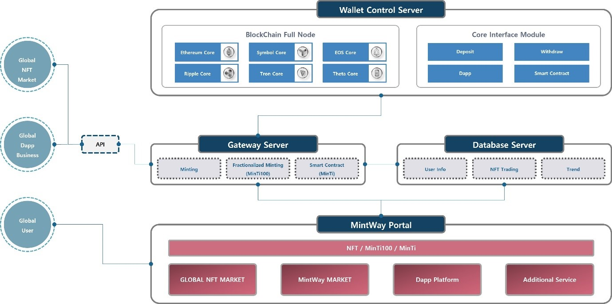

# 5. MINTWAY Portal Service Structure

The MINTWAY portal system allows us to produce NFTs through various blockchain networks, produce the multi-fractionalized NFTs  with MinTi100 in Ethereum-based blockchain network, trade NFTs and NFT license with MinTi, and interlock the control module to integrate all these blockchain networs in the wallet.

All transactions on the MINTWAY portal and separately contracted platforms (market, Dapp, etc.) go through the gateway server and can be viewed by the user in the transaction explorer, and the movement of MinTi generated through the transaction is stored in the database and displayed in the wallet after the transaction is completed.

In addition, after signing a contract with a company doing Dapp business with the global NFT market, it will be linked with the MINTWAY portal and serviced through API to users and MinTi. Even if it is not the MINTWAY portal, companies entering the MinTi ecosystem can use MinTi by linking with the API that can be connected to the MINTWAY wallet after signing a separate contract.

Through this, it is a wallet that integrates various blockchain networks, allowing users, markets, and Dapps related to NFT business to be bundled together and serviced all over the world.
