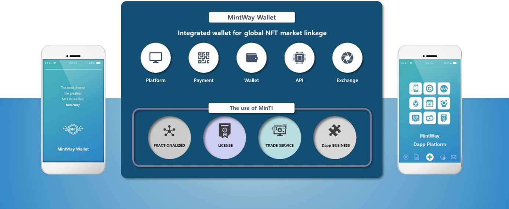

# 6. MINTWAY Ecosystem

MINTWAY는 최초의 NFT포탈로서 NFT 비즈니스를 통합하여 유저에게 보여주고, MINTWAY마켓을 통해 기존의 단순한 판매개념에서 벗어나 소유권을 분할과 라이선스 사용이라는 새로운 서비스를 제공하며, 유저가 직접 참여하여 수익을 얻을 수 있는 Dapp들의 플랫폼을 제공한다.

또한 신탁을 통해 NFT를 보관, 관리, 운영 및 인증서를 제공해서 NFT는 디지털 자산이라는 개념을 확실히 정의하여 실질적인 자산가치를 부여한다.

이외에도 다른 NFT마켓이나 Dapp서비스를 제공하는 회사의 요청 시 별도의 계약을 통해 MINTWAY 생태계안에 들어올 수 있으며, 지속적인 Dapp 개발을 통해 MINTWAY를 이용하는 유저를 확보할 것이다.

이 모든 것은 NFT를 보유한 유저가 자신의 디지털 자산을 통해 수익을 내고, NFT유형을 다양화하여 보다 많은 유저가 자신의 컨텐츠를 NFT로 만들 수 있게 하기 위함이다.

따라서 우리는 MINTWAY포탈, MINTWAY마켓, MINTWAY Dapp플랫폼이라는 3가지의 서비스를 통해 유저 자체가 생태계를 자연스럽게 구성하는 새로운 비즈니스로 수요처가 무한한 생태계를 유저에게 제공하려 한다.
