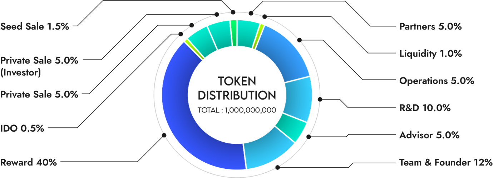

# 2. DISTRIBUTION

| Seed Sale                           | 1.5%   | 30,000,000     | 10% unlock monthly from TGE                            |
| ----------------------------------- | ------ | -------------- | ------------------------------------------------------ |
| 
 Private Sale

Investor
 | 5.0%   | 100,000,000    | 10% unlock monthly from TGE                            |
| Private Sale                        | 5.0%   | 100,000,000    | 5% unlock monthly from TGE                             |
| IDO                                 | 0.5%   | 10,000,000     | 100% unlock                                            |
| Reward                              | 40.0%  | 800,000,000    | 1/120th unlock monthly from TGE                        |
| Team & Founder                      | 12.0%  | 240,000,000    | Lock for 1 year from TGE, then 1/24th unlock per month |
| Advisor                             | 5.0%   | 100,000,000    | Lock for 1 year from TGE, then 1/12th unlock per month |
| R\&D                                | 10.0%  | 200,000,000    | 3% unlock monthly from TGE                             |
| Operations                          | 15.0%  | 300,000,000    | 2% unlock monthly from TGE                             |
| Liquidity                           | 1.0%   | 20,000,000     | Unlock                                                 |
| Partners                            | 5.0%   | 100,000,000    | Lock for 1 year from TGE, then 1/12th unlock per month |
|  Sum                                | 100.0% |  2,000,000,000 | 　                                                      |
