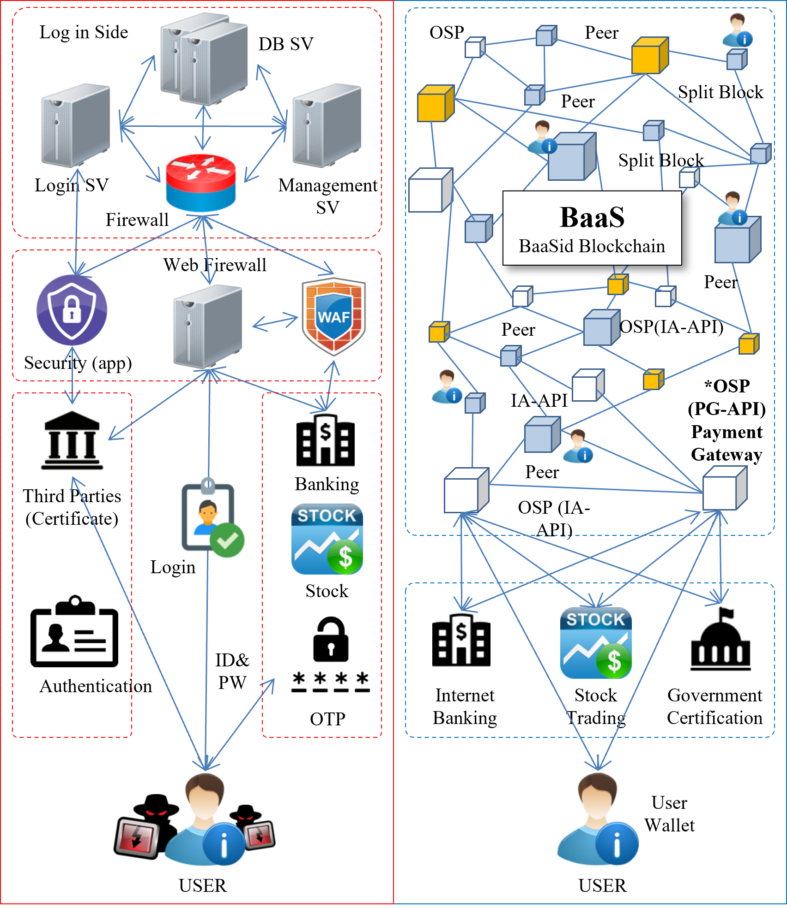

# 2. 토큰 배분 정책

<figure><figcaption></figcaption></figure>

| 시드세일      | 0.84%  | 16,800,000     | 배분 후 매월 10%씩 락 해제          |
| --------- | ------ | -------------- | -------------------------- |
|  프라이빗 세일Ⅰ | 1.16%  | 23,200,000     | 배분 후 매월 5%씩 락 해제           |
| 프라이빗 세일Ⅱ  | 7.50%  | 150,000,000    | 배분 후 매월 5%씩 락 해제           |
| 프리세일      | 2.5%   | 50,000,000     | 배분 후 매월 5%씩 락 해제           |
| 마케팅&리워드   | 40.0%  | 800,000,000    | 배분 후 매월 1/120씩 락 해제        |
| 팀 & 파운더   | 12.0%  | 240,000,000    | 배분 후 1년 이후부터 매월 1/24씩 락 해제 |
| 어드바이저     | 5.0%   | 100,000,000    | 배분 후 1년 이후부터 매월 1/12씩 락 해제 |
| 연구개발      | 10.0%  | 200,000,000    | 배분 후 매월 3%씩 락 해제           |
| 운영        | 15.0%  | 300,000,000    | 배분 후 매월 2%씩 락 해제           |
| 유동성공급     | 1.0%   | 20,000,000     | 락 없음                       |
| 파트너       | 5.0%   | 100,000,000    | 배분 후 1년 이후부터 매월 1/12씩 락 해제 |
|  계        | 100.0% |  2,000,000,000 | 　                          |
