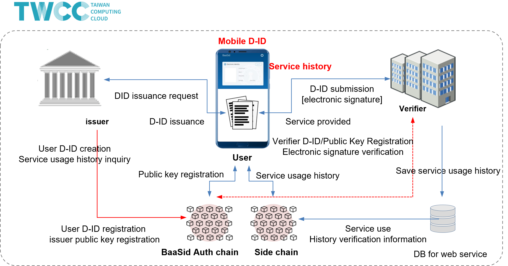

# 6.1. TWCC (Taiwan government agency DID development and supply)

<figure><figcaption></figcaption></figure>

The three words "blockchain", AI, and 5G are undoubtedly one of the topics that have occupied the most scientific and technological forums in the past two years. Among them, the blockchain is the most mysterious. In the course of the market, the blockchain has always been equated with the investment of virtual currency, and the cases of fraud applied to it are endless.

In fact, in addition to being regarded by people in the technology industry as the second wave of revolution after the Internet, this novel technology of blockchain will have the opportunity to influence the business models of various industries in the future with its unprecedented technical characteristics. The life area of ​​the general public.

The sound of blockchain development urges the country to officially invest in resources to build

As everyone knows, the National Development Council has long supported blockchain and other cutting-edge companies. It established the Taiwan Blockchain Alliance. Currently, it has included about 80 industry players, forming an industrial force that cannot be underestimated. At the same time, the establishment of a national-level blockchain has also begun to have a voice and legitimacy due to the introduction of the government and the needs of enterprises.

In addition, the specifications also require the addition of three application demonstrations of DID distributed identification service applications, hardware wallets, and cross-chain interoperability. With the national high-speed network center in Hsinchu, Taichung, and Tainan, as well as the most powerful high-speed computing power in Taiwan, this will be the prototype of the long-awaited Taiwan national chain in the blockchain industry.

BaaSId developed and provided the DID system required by the Taiwanese government through its own self-authentication blockchain. We are planning to develop various systems in the future.
