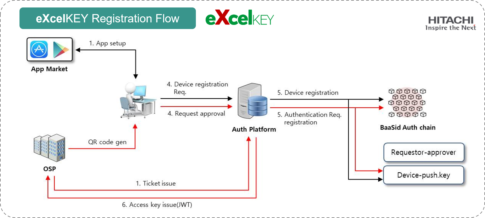

# 6.2. Hitachi Sunway (2FA, MFA Authenticator based on Blockchain & Decentralized Storage)

<figure><figcaption></figcaption></figure>

#### About eXcel Drive & eXcel KEY

Decentralized Storage (eXcel Drive) provided by BaaSid to Hitachi operates on a cloud basis. eXcel Drive is a new brand in Hitachi's ICT field, providing a variety of customer services and BaaSId’s It is a security storage service built by providing 100% decentralized storage solutions.

In addition, this decentralized storage technology provides innovative technology and security for data storage.

BaaSid's decentralized data storage processing technology without original copy, and one of the innovative data encryption and decryption technology.

Data splitting maximizes the security of strong source data. Also, thousands of pieces of data are stored separately on each node. These stored pieces are reassembled and assembled through authentication. In this process, BaaSid's authentication technology is combined with decentralized storage to create stronger security synergy.

<figure><figcaption></figcaption></figure>

<figure><figcaption></figcaption></figure>
