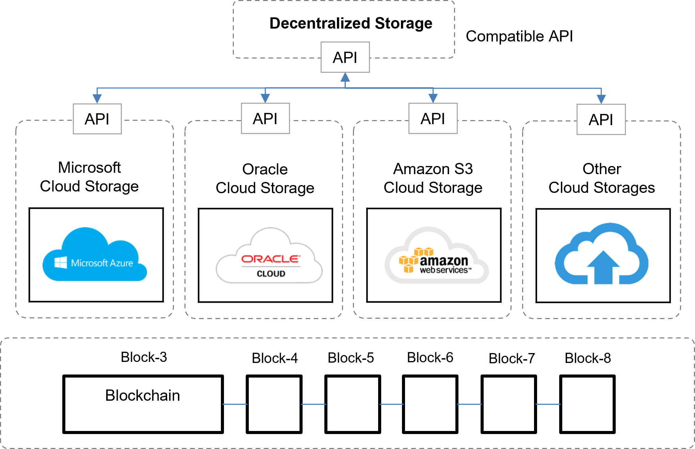
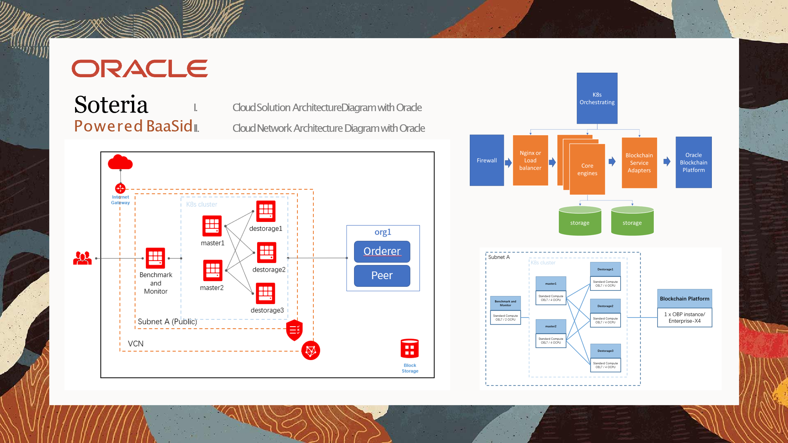
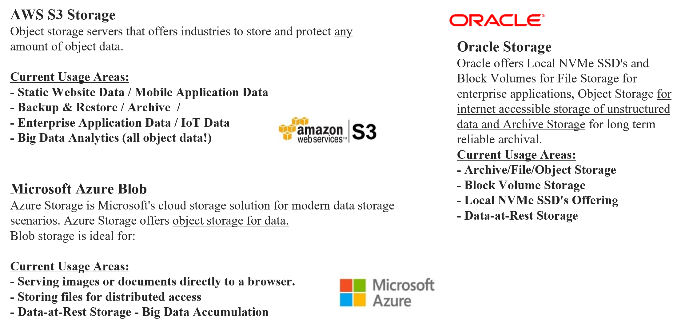

# 6.3. API interworking compatible with major clouds and fast and easy decentralized storage construct

BaaSid is currently registered in the Oracle internal market through a compatible API.

In addition, by interlocking with AMAZON's S3 storage and compatible API, customers can use decentralized storage whenever they use AMAZON S3's cloud.

New forms of decentralized storage services combined with cloud are implemented and serviced by building a user-oriented decentralized data storage that combines the existing cloud storage with a decentralized storage.

<figure><figcaption>
MBS : Multi Build Structure
</figcaption></figure>

De Storage has strategically adopted the compatible storage method which is compatible with existing cloud storages such as  AWS, MS Azure, and Oracle, who are dominating the existing cloud market, thus allowing existing cloud customers to conveniently and stably access and use De Storage. This can enhance user convenience, accessibility, and work efficiency by using the powerful data fragmentation and physical distribution method of decentralized storage.

De Storage will continuously update its APIs to enhance compatibility with existing cloud storages and allow users to  access and use its services as conveniently and easily as possible.

Sufficient time and solidarity are required to use the concept of decentralization in the existing centralized market. Therefore, De Storage needs to adopt a customization strategy to enable integration of its services on the existing architecture to enhance compatibility with the existing centralized IT infrastructures.

<figure><figcaption></figcaption></figure>

<figure><figcaption></figcaption></figure>
